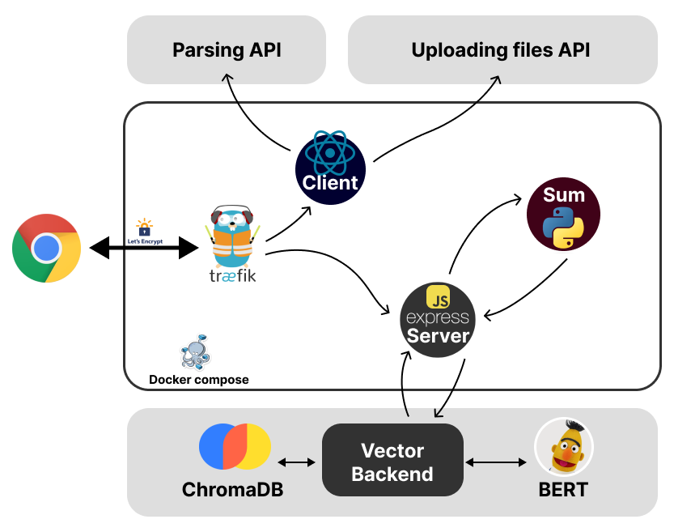
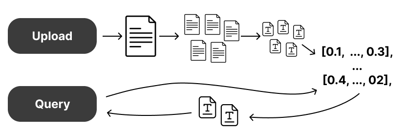

# Document Summarization and Vector Storage Project

## Overview

This project aims to provide a comprehensive solution for document summarization and storage in vector representation for fast and efficient search. The system allows users to input text, parse websites, or upload documents, which are then broken down into fragments. Each fragment undergoes a summarization process using a T5 model. These summarized fragments are sent to a vector backend, where embeddings are created using a BERT model and stored in a vector database. Users can then query the system to retrieve semantically dense and concise fragments from all documents.

## Features

- **Text Input and Parsing**: Users can input text directly, use an API for website parsing, or upload documents.
- **Summarization**: Text fragments are summarized using a T5 model.
- **Vector Storage**: Summarized fragments are converted into embeddings using a BERT model and stored in a vector database.
- **Fast Search**: Retrieve semantically dense and concise fragments from all documents based on user queries.
- **Authorization**: User authentication via Telegram.
- **Microservices**: Custom microservices for website parsing, file reading, and vector database management.
- **Reverse Proxy and HTTPS**: Managed by Traefik.
- **Docker Compose**: For building and deploying the entire stack.

## Technology Stack

- **Frontend**: React
- **Backend**: Express.js
- **Summarization Service**: FastAPI
- **Reverse Proxy**: Traefik
- **Containerization**: Docker Compose
- **Authentication**: Telegram
- **Microservices**: Custom services for parsing websites, reading files, and vector database with BERT embeddings

## Architecture

The architecture of the project is designed to be modular and scalable, utilizing microservices for different functionalities. Below is a high-level overview of the architecture:



## Example

Here is an example of how the system works:

1. **User Input**: The user inputs text, parses a website, or uploads a document.
2. **Fragmentation**: The text is broken down into fragments.
3. **Summarization**: Each fragment is summarized using the T5 model.
4. **Vectorization**: Summarized fragments are converted into embeddings using the BERT model.
5. **Storage**: Embeddings are stored in the vector database.
6. **Query**: The user queries the system to retrieve relevant fragments.



## Getting Started

### Prerequisites

- Docker and Docker Compose installed on your machine.

### Installation

1. Clone the repository:
   ```bash
   git clone https://github.com/shanth1/summarization
   cd summarization
   ```

2. Set up environment variables:
   Create a `.env` file in the root directory and add the necessary environment variables.

3. Build and start the services using Docker Compose:
   ```bash
   docker-compose up --build
   ```

### Usage

1. **Frontend**: Access the React frontend at `http://localhost:3000`.
2. **API**: Interact with the Express.js backend and FastAPI summarization service.
3. **Authentication**: Authenticate using Telegram.
4. **Querying**: Use the frontend or API to query the vector database and retrieve summarized fragments.

## Contributing

We welcome contributions!

## License

This project is licensed under the MIT License. See the [LICENSE](LICENSE) file for details.

## Contact

For any questions or suggestions, please open an issue or contact us at [shanthi.bunch@gmail.com].
